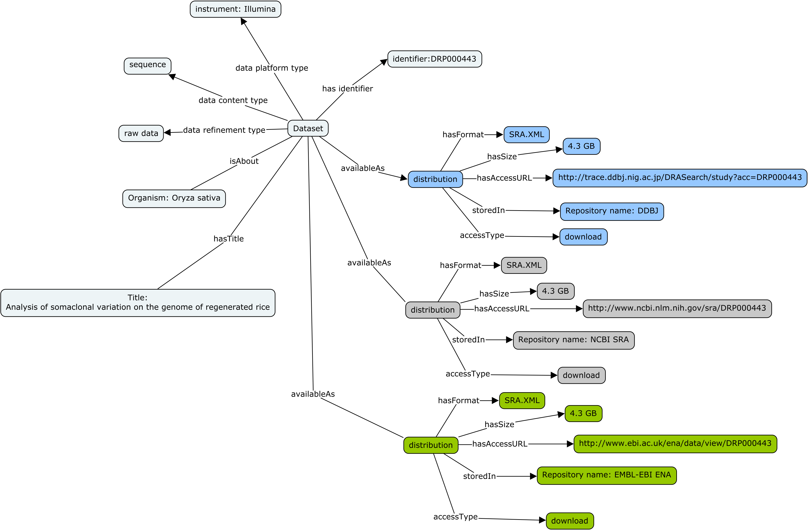

####################
Dataset Distribution
####################

Where and How (can the dataset be accessed):

- Document DataSet Distribution options. This encompasses specifying:

	- data availability (boolean choice: available, unavailable)
	- data formats or mime-types ([terminology needs to be specified] 'resource: <https://github.com/lukaszsliwa/friendly_mime/blob/master/mimes.csv>`_)
	- data access conditions
	- data compression (boolean choice: compressed, uncompressed)
	- data encryption (boolean choice: encrypted, non-encrypted)
	- data privacy protection (fully identifiable, pseudo-anonymized, full anonymized….[terminology needs to be specified])

The image below provides an graphical overview of how to use Biocaddie DATS objects to encode information about dataset availability in a similar file format but from 3 distinct data repositories, each with it own access modalities.

The three INSDC sequence databases (DDBJ, SRA and ENA) exchange their data and provide the same datasets it in the three sites. Let’s consider an example dataset.

The same Dataset identified by accession number DRP000443 can be accessed through the following 3 access URI pages:

- `DDBJ: <http://trace.ddbj.nig.ac.jp/DRASearch/study?acc=DRP000443>`_
- `SRA: <http://www.ncbi.nlm.nih.gov/sra/DRP000443>`_
- `ENA: <http://www.ebi.ac.uk/ena/data/view/DRP000443>`_

While the distributions use the same Format, the accessURL are different as are the Repository but these distributions are all about the same dataset 

The block below shows a snippet of a bioCADDIE DATS JSON document holding key information about dataset distribution. Note the link to *access information* and *data file format* information.

.. literalinclude:: _static/dataset_distribution_schema.json
   :language: json

