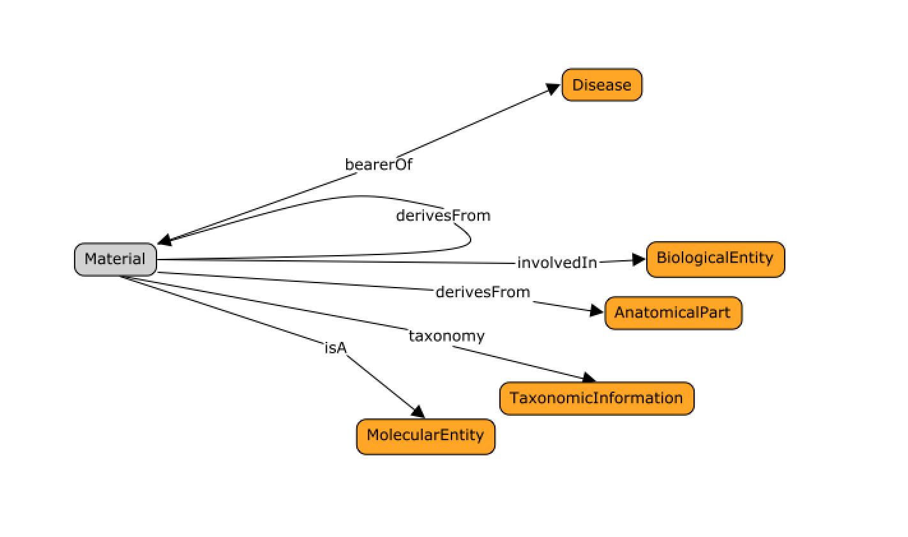
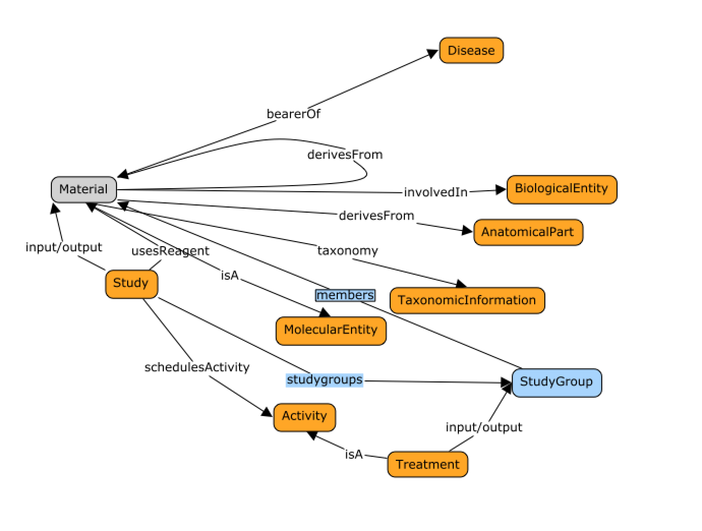

####################
Counting things (I): 
####################

Tracking patient and specimen relationships
-------------------------------------------

Relationships between materials matter. It is therefore important for the model to be able to represent information assessing sample / specimen origin and patient identity.
For instance, in the context of longitudinal studies, repeated measure designs, where samples are collected or variables measured several times over the course of a study.
The figure below shows the main properties of the DATS `Material <https://github.com/biocaddie/WG3-MetadataSpecifications/blob/master/json-schemas/material_schema.json>`_ object, with associations to key biologically relevent entities such as `Anatomical Part <https://github.com/biocaddie/WG3-MetadataSpecifications/blob/master/json-schemas/anatomical_part_schema.json>`_ ,
 `Disease <https://github.com/biocaddie/WG3-MetadataSpecifications/blob/master/json-schemas/disease_schema.json>`_ , or `Molecular Entity <https://github.com/biocaddie/WG3-MetadataSpecifications/blob/master/json-schemas/molecular_entity_schema.json>`_

Note the ease of use and compatibility with biomedical ontologies owing to 'familiarity and awareness’ of DO, GO, UBERON and the likes.

Groups and sizes in the context of studies
------------------------------------------

For all datasets characterising “signal”, the ability to identify, list and characterise study populations matters, as does the ability to capture descriptors for ‘treatment’ or ‘perturbations’.

As shown in the figure above, the Data `Study <https://github.com/biocaddie/WG3-MetadataSpecifications/blob/master/json-schemas/study_schema.json>`_ object allows the declaration and identification of groups (DATS `Study Groups <https://github.com/biocaddie/WG3-MetadataSpecifications/blob/master/json-schemas/study_group_schema.json>`_) of related materials as well as list all their members. 

