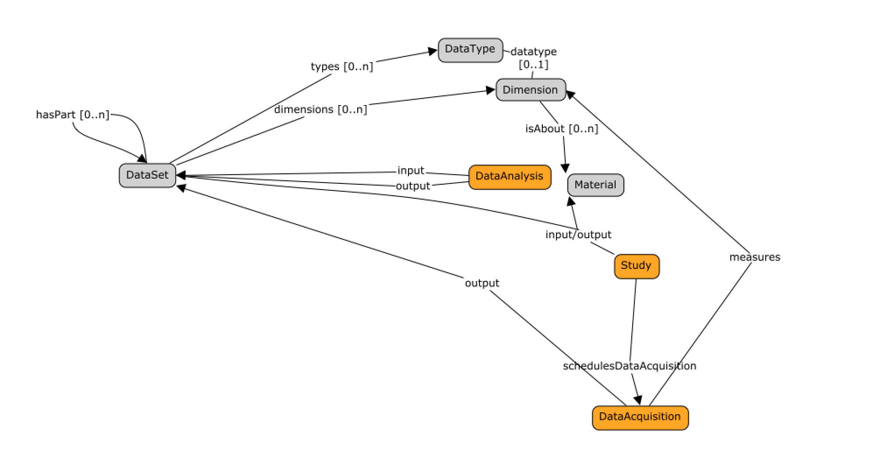

######################
DATS Measuring things: 
######################

This section describes the DATS objects for supporting the description of variables , dimensions and their relation to datasets.

The nature of the information available in a dataset can be recorded via  the DATS `Dimension <https://github.com/biocaddie/WG3-MetadataSpecifications/blob/master/json-schemas/dimension_schema.json>`_ entity. It is the object to use for reporting variables measured and for which data have been collected.

The DATS Dimension object can be qualitied using the DATS `DataType <https://github.com/biocaddie/WG3-MetadataSpecifications/blob/master/json-schemas/data_type_schema.json>`_ entity.

The DATS *DataType* covers four aspects of a variable's nature: type of information (what the data is about), method (how the data was generated), platform (the instrumentation, software and reagents used to generate the data), and instrument (the specific device used to generate the data).

Importantly, it is key to remember that Dataset may be constitutive parts of another Dataset. Each of these dataset parts can be used to describe a particular aspect of a dataset in greater details. For instance, a dataset describing a multi-omics experiment may contain several datasets, one focusing on transcriptomics, one focusing on metabolomics and so on.

DATS.Dimension: meant to be used to report what data points are about in a dataset, their nature, their units.

DATS.Dimension should be typed (categorical, continuous)

DATS.Dimension used from the following DATS objects:

	DATS. `Material <https://github.com/biocaddie/WG3-MetadataSpecifications/blob/master/json-schemas/material_schema.json>`_ .characteristics.Dimension

	DATS. `DataAcquisition <https://github.com/biocaddie/WG3-MetadataSpecifications/blob/master/json-schemas/data_acquisition_schema.json>`_ .measures.Dimension
